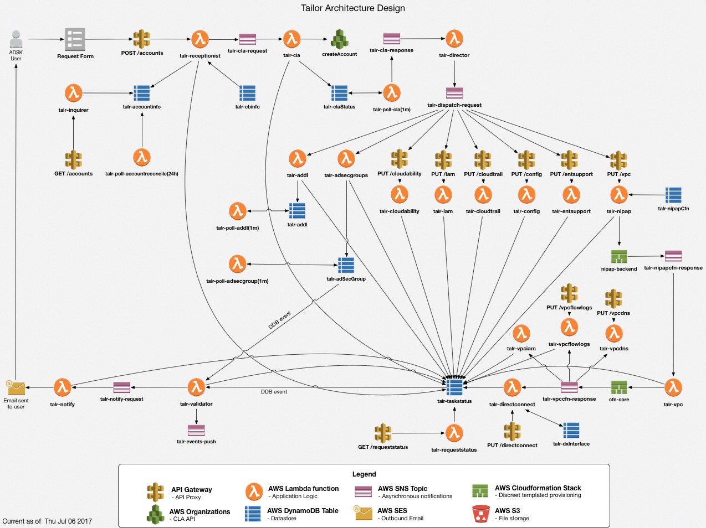
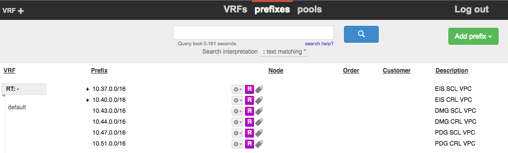

[](https://www.codacy.com/app/alanwill/aws-tailor?utm_source=github.com&utm_medium=referral&utm_content=alanwill/aws-tailor&utm_campaign=badger)

## Tailor - the AWS Account Provisioning Service

<p align="center"></p>

<!-- START doctoc generated TOC please keep comment here to allow auto update -->
<!-- DON'T EDIT THIS SECTION, INSTEAD RE-RUN doctoc TO UPDATE -->
**Table of Contents**

- [What is Tailor?](#what-is-tailor)
- [Architecture](#architecture)
  - [Serverless](#serverless)
  - [Extensible](#extensible)
  - [Reusable](#reusable)
- [Configured AWS and Third Party Services](#configured-aws-and-third-party-services)
  - [IAM](#iam)
    - [Lambda Roles](#lambda-roles)
    - [ECS Role](#ecs-role)
  - [CloudTrail](#cloudtrail)
  - [Config](#config)
  - [Direct Connect](#direct-connect)
  - [VPC](#vpc)
  - [Enterprise Support](#enterprise-support)
  - [Cloudability](#cloudability)
- [Lambda functions](#lambda-functions)
  - [talr-receptionist](#talr-receptionist)
    - [Request](#request)
    - [Responses](#responses)
    - [Function Inputs](#function-inputs)
  - [talr-cla](#talr-cla)
    - [Input](#input)
    - [Output](#output)
  - [talr-director](#talr-director)
    - [Input](#input-1)
    - [Output](#output-1)
  - [talr-iam](#talr-iam)
    - [Input](#input-2)
    - [Output](#output-2)
  - [talr-cloudtrail](#talr-cloudtrail)
    - [Input](#input-3)
    - [Output](#output-3)
  - [talr-config](#talr-config)
    - [Input](#input-4)
    - [Output](#output-4)
  - [talr-entsupport](#talr-entsupport)
    - [Input](#input-5)
    - [Output](#output-5)
  - [talr-vpc](#talr-vpc)
    - [Input](#input-6)
    - [Output](#output-6)
  - [talr-directconnect](#talr-directconnect)
    - [Input](#input-7)
    - [Output](#output-7)
  - [talr-inquirer](#talr-inquirer)
    - [Input](#input-8)
    - [Output](#output-8)
  - [talr-validator](#talr-validator)
    - [Input](#input-9)
    - [Output](#output-9)
  - [talr-notify](#talr-notify)
    - [Input](#input-10)
    - [Output](#output-10)
- [DynamoDB Tables](#dynamodb-tables)
  - [talr-cbInfo](#talr-cbinfo)
  - [talr-accountInfo](#talr-accountinfo)
  - [talr-taskStatus](#talr-taskstatus)
- [SNS Topics](#sns-topics)
  - [talr-cla-request](#talr-cla-request)
  - [talr-cla-response](#talr-cla-response)
  - [talr-dispatch-request](#talr-dispatch-request)
  - [talr-cfn-response](#talr-cfn-response)
  - [talr-notify-request](#talr-notify-request)
  - [talr-events-push](#talr-events-push)
- [API Reference](#api-reference)
  - [POST /account](#post-account)
  - [POST /iam](#post-iam)
  - [POST /cloudtrail](#post-cloudtrail)
  - [POST /config](#post-config)
  - [POST /entsupport](#post-entsupport)
  - [POST /vpc](#post-vpc)
  - [POST /directconnect](#post-directconnect)
  - [GET /account](#get-account)
- [Error Messages](#error-messages)
- [Task Status](#task-status)
- [Conventions/Standards](#conventionsstandards)
- [Operations](#operations)
  - [Accessing IPAM console](#accessing-ipam-console)

<!-- END doctoc generated TOC please keep comment here to allow auto update -->

## What is Tailor?
Tailor is a service that provisions and configures AWS accounts in accordance to a company's standards. It's built to support an infinite number of accounts.

"Tailor-made AWS accounts"

The primary intent is to provision _new_ AWS accounts as well as configure existing accounts.

The following AWS services are configured (or enabled) via Tailor:

* IAM
* CloudTrail
* Config
* Direct Connect
* VPC
* Enterprise Support

## Architecture
Tailor is architected to be a serverless, extensible and reusable service. Additionally it's built with the [Serverless Framework](http://serverless.com) which enables rapid development of AWS Lambda functions and their related resources. The AWS specific codebase is written entirely in Python 2.7 using the AWS Python SDK and deployed to AWS Lambda while the API proxy facade is written in Node.js and deployed to Apigee Edge.

### Serverless
Tailor's architecture requires the management of _zero_ servers. There are no machines to patch, configure or maintain. It relies on various [AWS Lambda](http://docs.aws.amazon.com/lambda/latest/dg/welcome.html) functions for its primary compute layer.

### Extensible
Tailor is composed of various Lambda functions that each perform a specific task or set of tasks, for example configure CloudTrail or configure IAM. Due to the discreet nature of these functions, Tailor allows for new functions to be added in order to extend the service's capabilities.

### Reusable
One of the core design principles behind Tailor is to be reusable. Not only is the same service sharable by multiple divisions with distinct Payer accounts, but the entire code base can be run in another environment and would work out of the box.



## Configured AWS and Third Party Services

### IAM
The Identity and Access Management (IAM) service is leveraged for generally 2 use cases, the first is to enable access to an AWS account. When a user logs into AWS with their corporate SSO credentials, the role that governs their authorization is one of 6 IAM roles with a trust relationship to an IAM SAML provider, a.k.a [IAM SAML Roles](#iam-saml-roles). The second use case, is for roles which can be assumed by other AWS services, for example [Lambda](#lambda-roles) and [ECS roles](#ecs-role). Tailor creates the roles and policies that support both these use cases.


#### Lambda Roles
| Role Name | Purpose | Policies |
| ---- | ------ | -------- |
| <company-ticker>LambdaBasicExecutionRole | Basic execution role for Lambda supporting the ability to push logs to Cloudwatch Logs  | AWS Managed Policy: <ul><li>AWSLambdaBasicExecutionRole</li></ul> |
| <company-ticker>LambdaVpcAccessExecutionRole | Basic execution role for Lambda supporting the ability to push logs to Cloudwatch Logs  | AWS Managed Policy: <ul><li>AWSLambdaVPCAccessExecutionRole</li></ul> |

#### ECS Role
| Role Name | Purpose | Policies |
| ---- | ------ | -------- |
| <company-ticker>EcsInstanceRole | EC2 instance role for attaching to ECS nodes  | AWS Managed Policy: <ul><li>AmazonEC2ContainerServiceforEC2Role</li></ul> |


### CloudTrail

### Config

### Direct Connect

### VPC

### Enterprise Support

### Cloudability


## Lambda functions
Tailor is comprised of a number of discrete Lambda functions written in Python. Below we'll list them all and explain what each does.

### talr-receptionist
The receptionist function receives and validates account requests in the form of a JSON payload via HTTP POST calls to /account.

#### Request
A creation request must include the following JSON payload in the body of the request:
```JSON
{
  "accountRequest": {
      "accountCbAlias" : "acme-main",
      "accountRegulated" : True,
      "accountVpcAzCount" : "2",
      "accountVpcPrefix" : "/24",
      "accountRegion" : "us-east-1",
      "accountTagCostCenter" : "1000100099",
      "accountTagLongProjectName" : "My Super Fancy Project",
      "accountTagShortProjectName" : "MSFP",
      "accountTagEnvironment" : "tst",
      "accountUserAccessList" : "obamabadmin",
      "accountTechnicalContactFullName": "Walter White",
      "accountTechnicalContactUsername": "whitew",
      "requestorFullName" : "John Doe",
      "requestorUsername" : "doej",
      "requestorManager" : "Fred Flinstone",
      "requestorDepartment" : "Internal Affairs",
      "requestorEmailAddress" : "john.doe@mycompany.com",
      "externalTransactionId" : "RITM00001",
      "comment" : "Special Tag here"
  }
}
```

| Field | Type | Required | Description |
| ----- | ---- | -------- | ----------- |
| accountCbAlias | string | Y | This is an alias associated with a payer account. A company with multiple payer accounts would have a distinct alias per payer. |
| accountRegulated | boolean | Y | True/False if that account is regulated. Regulated accounts are ones that are subject to external audit and regulatory controls, like SOx etc. |
| accountVpcAzCount | string | Y | Number of AZs to provision the VPC into. This can be either 2 or 3 |
| accountVpcPrefix | string | Y | VPC network prefix, currently only /24 is supported. |
| accountRegion | string | Y | The region where the VPC should be deployed. Currently only supports a single region but will be made into a list soon |
| accountTagCostCenter | string | Y | Cost Center to be cross charged for account spend |
| accountTagLongProjectName | string | Y | A descriptive name for the account which can include spaces. |
| accountTagShortProjectName | string | Y | A short name for the account with no spaces. For example project or application or team acronym |
| accountTagEnvironment | string | Y | Intended account environment. See list Function Inputs section below for valid list of values |
| accountUserAccessList | string | Y | List of AD admin accounts which require read/write access to the account |
| accountTechnicalContactFullName | string | Y | Specify the name of the person who has technical know-how of what's deployed in the account. This could be the same person as the requestor. |
| accountTechnicalContactUsername | string | Y | Specify the username of the person who has technical know-how of what's deployed in the account. This could be the same person as the requestorUsername. |
| requestor* | string | Y | These fields are fairly self explanatory and can be auto-populated for requests originating from ServiceNow |
| externalTransactionId | string | N | Can contain any field or value for reference purposes and to be associated with the account. Tailor has no technical dependency on this field. Field is mandatory but value can be left as an empty string. |
| comment | string | N | Optional comment. Field is mandatory but value can be left as an empty string. |

See *Function Inputs* below for field constraints.
#### Responses

A successful response will return an HTTP 200 status code with the following content:
```JSON
{
    "code": "2000",
    "message" : "Request Accepted",
    "requestId": "f7ad919d-c855-4bb7-9635-fc7c22cba537"
}
```

A request which will lead to an account with a duplicated email address will be caught in the validation process and a failure response sent as an HTTP 409 status code:
```JSON
{
    "code": "4090",
    "message": "Duplicate request"
}
```

Other possible error codes include code 4000 (HTTP status 400) which means that one of the fields in the JSON body is either missing or incorrectly populated (check the value including its length):
```JSON
{
    "code": "4000",
    "message": "Bad request"
}
```

#### Function Inputs
The following table outlines all input fields which talr-receptionist either calculates, derives or validates from the client's payload:

| Field | Type | In  | Constraint | Required | Description |
| ----- | ---- | --- | ---------- | -------- | ----------- |
| requestId | string | lambda | 100 | Calculated | v4 UUID |
| requestTime | number | lambda | 10 | Calculated | epoch value of request received time |
| accountEmailAddress | string | lambda | 50 | Derived | Unique account email address |
| accountCbAlias | string | body | 10 | Yes | Alias name of Payer account aka Consolidated Billing (CB) |
| accountRegulated | boolean | body |  | Yes | Signifies the account is subject to external regulatory controls. |
| accountVpcAzCount | string | body | 1 | Yes | Number of AZs to provision for VPC, either 2 or 3 |
| accountVpcPrefix | string | body | 1 | Yes | VPC network prefix, currently only /24 is supported. |
| accountRegion | string | body | 15 | Yes | Region to provision VPC, either us-east-1 or us-west-1 |
| accountTagCostCenter | string | body | 10 | Yes | Cost Center financially responsible for account spend |
| accountTagLongProjectName | string | body | 30 | Yes | Long-form project name to be associated with account |
| accountTagShortProjectName | string | body | 10 | Yes | Short-form (acronym) project name |
| accountTagEnvironment | string | body | 3 | Yes | Intended environment use, i.e. dev/stg/prd/alpha/beta/prod |
| accountUserAccessList | string | body | 200 | Yes | List of users who need access to account, AD admin (secondary) usernames |
| accountTechnicalContactFullName | string | body | 50 | Yes | Named technical contact for the account. Could be the same as requestor |
| accountTechnicalContactUsername | string | body | 15 | Yes | Named technical contact's corporate username. Could be the same as requestorUsername  |
| requestorFullName | string | body | 50 | Yes | Requestor Full Name|
| requestorUsername | string | body | 50 | Yes | Requestor's corporate user name|
| requestorManager | string | body | 50 | Yes | Requestor's manager's full name|
| requestorDepartment | string | body | 40 | Yes | Requestor's department name |
| requestorEmailAddress | string | body | 50 | Yes | Requestor's email address |
| externalTransactionId | string | body | 50 | No | This can be any number or string that needs to be associated with the account for reporting purposes. For example a ServiceNow ticket number |
| comment | string | body | 100 | No | Comment |

Values from the above fields are persisted to DynamoDB in `talr-accountInfo` and the Consolidated Billing (cb) info is looked up from `talr-cbInfo`.

### talr-cla
The CLA function calls the AWS Accounts Service (aka CLA - Create Linked Account API) to create a linked account.

#### Input

#### Output

### talr-director
The director function, receives the response from the CLA service via subscription to talr-cla-response. Since the CLA service reports a few different responses, talr-director iterates through each response and responds appropriately.

For a success, it validates that the account is accessible by setting the IAM account alias then updating talr-taskStatus table with a success event.
For a failure, it updates the talr-taskStatus table with a failure event.

#### Input

#### Output

### talr-iam
This function configures the standard suite of IAM roles as well as the SAML provider and populates policies both AWS Managed and Customer Managed for each role.

#### Input

#### Output

### talr-cloudtrail
This function configures Cloudtrail by creating a `default` All Region trail then setting events to be persisted to a central S3 bucket that's used by all accounts. SNS is not configured.

#### Input

#### Output

### talr-config
This function configures AWS Config in every region and provisions a delivery channel. Events are configured to be sent to a central bucket common across all linked accounts, per payer account. Config Rules are also provisioned.

#### Input

#### Output

### talr-entsupport
This function creates a Support Case in the payer account to configure the new linked account with Enterprise Support.

#### Input

#### Output

### talr-vpc
This function invokes the [cfn-core](https://github.com/alanwill/cfn-core) Cloudformation template asynchronously in each region specified by the requestor. Cloudformation publishes its completion status to talr-cfn-response. The CIDR block for the VPC is looked up in an IPAM and the function determines the size of each subnet based on the VPC size requested by the user.

DENY policies for the ServerAdmins and ApplicationAdmins IAM roles are also provisioned.

#### Input

#### Output

### talr-directconnect
This function configures Direct Connect per VPC by looking up available VLANs in IPAM. It runs once a success event has been published to talr-cfn-response signaling that the VPC was provisioned successfully.

#### Input

#### Output

### talr-inquirer
The inquirer function accepts HTTP GET calls to look up account provisioning status. It can also be used to look up when an account was created.

#### Input

#### Output

### talr-validator
The validator function checks the status of each task function to ensure it completed. Once all tasks are completed it composes an email for the user and publishes an event to talr-notify-request to send the email. An event is also sent to talr-events-push with a payload that can be consumed by tertiary systems needing to be notified when an account is created.

#### Input

#### Output

### talr-notify
This function receives a payload from the talr-notify-request SNS topic which includes the contents of an email to be sent, including the recipients. The function then uses SES to send the email.

#### Input

#### Output

## DynamoDB Tables

### talr-cbInfo

### talr-accountInfo

### talr-taskStatus

## SNS Topics

### talr-cla-request

### talr-cla-response

### talr-dispatch-request

### talr-cfn-response

### talr-notify-request

### talr-events-push

## API Reference

Tailor's APIs are described in Postman collections, click on the button below to import them and start using the APIs immediately.
[](https://app.getpostman.com/run-collection/6a04c161fa9d76ce0339)

### POST /account

### POST /iam

### POST /cloudtrail

### POST /config

### POST /entsupport

### POST /vpc

### POST /directconnect

### GET /account

## Error Messages

| HTTP Status Code | Code | Message |
| ---------------- | ---- | ------- |
| 409 | 4090 | ERROR: Duplicate request |
| 400 | 4000 | ERROR: Bad request |
| 500 | 5000 | ERROR: An internal error occurred. Contact the AWS Operations team |
| - | 601 | ERROR: Linked account failed to create |

## Task Status

| Task | Status | Function | Description |
| ---- | ------ | -------- | ----------- |
| REQUEST_VALIDATION | start/end | talr-receptionist | requestId generated and request payload validated |
| CLA_SUBMISSION | start/end | talr-cla | Request sent to CLA service for processing |
| CLA_CREATION | start/end | talr-director | Linked account provisioning start notification received from CLA service |
| CLA_VALIDATION | start/end | talr-director | Linked account assume-role access validated |
| IAM | start/end | talr-iam | Confuguring the IAM service |
| CLOUDTRAIL | start/end | talr-cloudtrail | Configuring the Cloudtrail service |
| AWSCONFIG | start/end | talr-awsconfig | Configuring the AWS Config service |
| VPC | start/end | talr-vpc | Configuring the VPC service |
| DIRECT_CONNECT | start/end | talr-directconnect | Configuring the Direct Connect service |
| AD_SEC_GROUPS | start/end | talr-adsecgroups | Provisioning AD security groups |
| AD_DL | start/end | talr-addl | Provisioning AD distribution list |
| CONFIGURATION_CHECK | complete | talr-validator | Final account validation and verification that all services configured successfully |
| READY | notified | talr-notify | Confirmation email dispatched to user |

Sample DynamoDB Item:
```JSON
{
  "requestId": "e74743c6-8e8e-40f3-b200-3509b8912e13",
  "REQUEST_VALIDATION": {
    "startTimestamp": "1464742381.02",
    "endTimestamp": "1464742382.07",
    "function": "talr-receptionist",
    "message": "None"
  },
  "CLA_SUBMISSION": {
    "startTimestamp": "1464742382.86",
    "endTimestamp": "1464742386.08",
    "function": "talr-cla",
    "message": "None"
  },  
  "CLA_CREATION": {},
  "CLA_VALIDATION": {},
  "CLOUDTRAIL": {},
  "IAM": {},
  ...
}
```

## Conventions/Standards

* Code written in Python 2.7
* Times are recorded in epoch format
* Coding conventions follow the PEP8 standard

## Operations

### Accessing IPAM console

* Launch the [cfn-nipap-daemon.json](serverless/s3-artifacts/cfn/cfn-nipap-daemon.json) CloudFormation template with the following parameters:
 * TailorComponentsSecurityGroup. GroupId of the existing tailor-nipap-backend-SgTailorComponents security group.
 * TailorNipapDaemonAmi. Id of the `Tailor NIPAP Daemon` AMI found in the same account.
* Once the stack creates from the EC2 console right click on it and `Launch More Like This`
 * Click on Launch then launch the instance with a keypair.
* Modify the `*NipapDaemonSg*` security group that's attached to the instance to add an inbound SSH rule as well as TCP 5000 (web UI).
* SSH to the instance using the `ubuntu` user
* Once on the instance run `sudo paster serve /etc/nipap/nipap-www.ini`
* Navigate to the NIPAP UI at http://<ec2-instance-ip>:5000
* Log in with `tailor` NIPAP user and password

<p align="center"></p>
