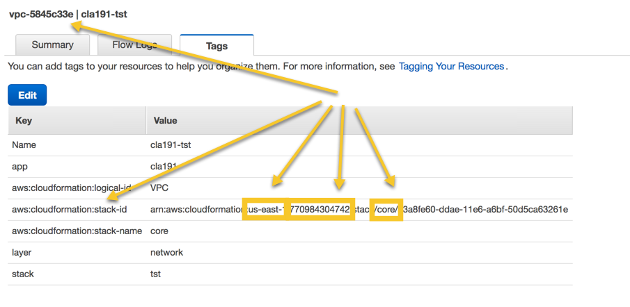
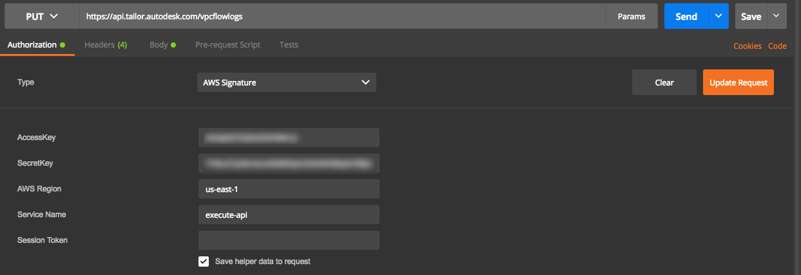
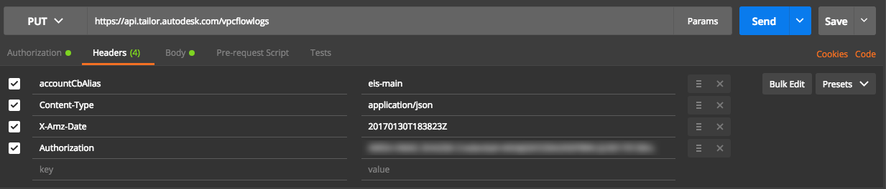
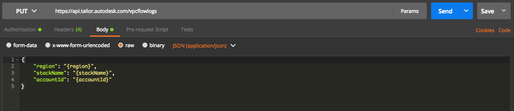

# Using the /vpcflowlogs endpoint

The `/vpcflowlogs` endpoint is a PUT enabled resource which allows for VPC Flow Logs to be enabled on an existing account.

Once enabled, logs are dispatched to a Kinesis Stream in the Core Services account where the logs are persisted in S3 for consumption.

## Assumptions

* The VPC was created with [cfn-core](https://github.com/alanwill/cfn-core)
* VPC exists in us-east-1, us-west-1 or us-west-2
* Account is known to Tailor, meaning the account either was created by Tailor or is part of a support AWS Billing/Payer Account

## Authorization

Like all Tailor APIs, this endpoint is authorized via AWS IAM credentials and all requests must be signed with [AWS's Signature Version 4](https://docs.aws.amazon.com/general/latest/gr/sigv4_signing.html) signing process.

In order to use this endpoint IAM access and secret keys would need to be provisioned for you ahead of time. Contact the internal AWS Support Team for access.

## API Request

The request is a PUT method comprised of 2 unique parameters:

* Header: `accountCbAlias`
* Request body (application/json content type):
```
{
    "region": "{region}",
    "stackName": "{stackName}",
    "accountId": "{accountId}"
}
```

where `stackName` refers to the name Cloudformation stack used to create the VPC (this should be a cfn-core template). Looking at an existing VPC and reviewing the Tags would give you all the information needed to populate the request body:



## API Response

A successful response will return a 202 HTTP status code and a payload similar to the following:

```
{
  "message": "Request Accepted",
  "code": "2020",
  "requestId": "bcc394a5-87c1-49bd-beac-g4308a67d227"
}
```

Other possible responses are:
* 400 - Typically if there's a missing header or body or incorrect values for either.
* 404 - Typically if either the account is unknown or the stackName is incorrect or the region is incorrect

The resulting `requestId` in the 202 response can subsequently be used in the [/requeststatus](./requeststatus.md) endpoint to query the status of the request.

## Calling the API via Postman

The following steps walk through how to using [Postman](https://www.getpostman.com/) to invoke the /vpcflowlogs API:

1. Configure AWS SigV4 authorization:
    

    Click on the orange `Update Request` button so that the AWS headers are populated.

2. Set the `accountCbAlias` request header:
    

3. Specify the request body:
    

    Click Send.
